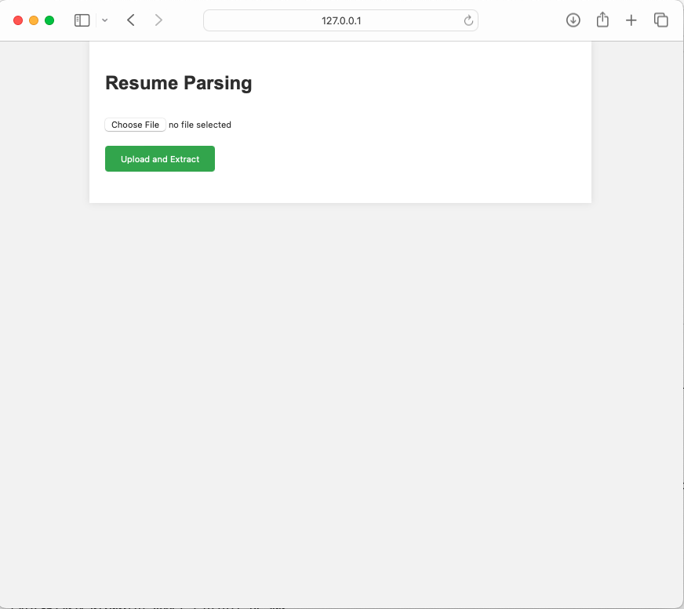
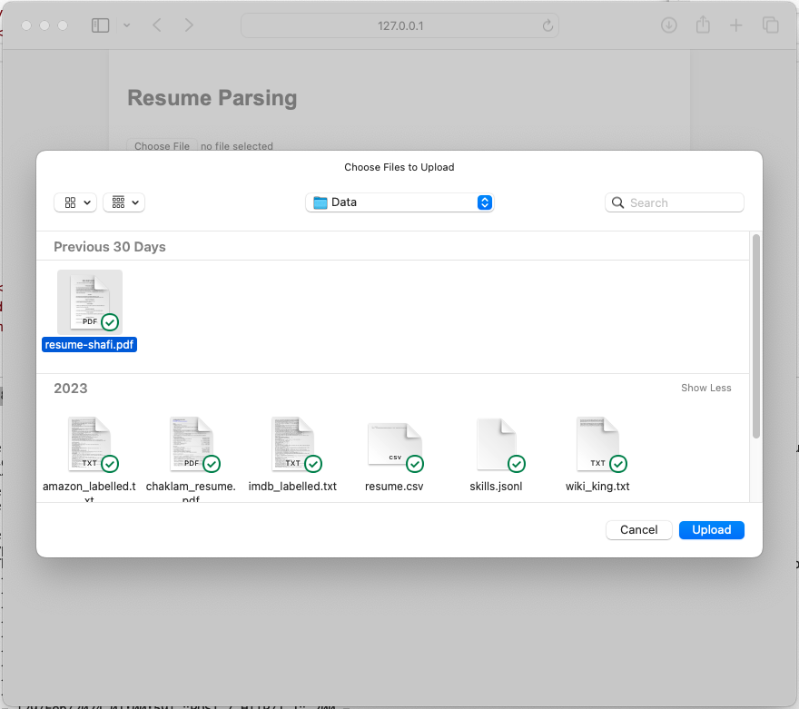
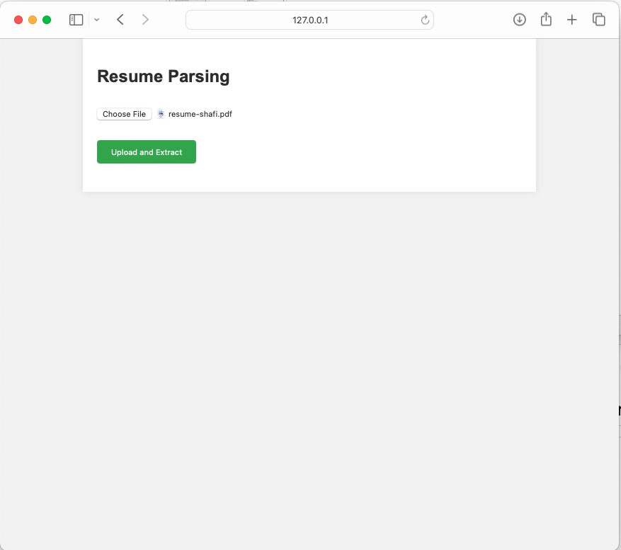
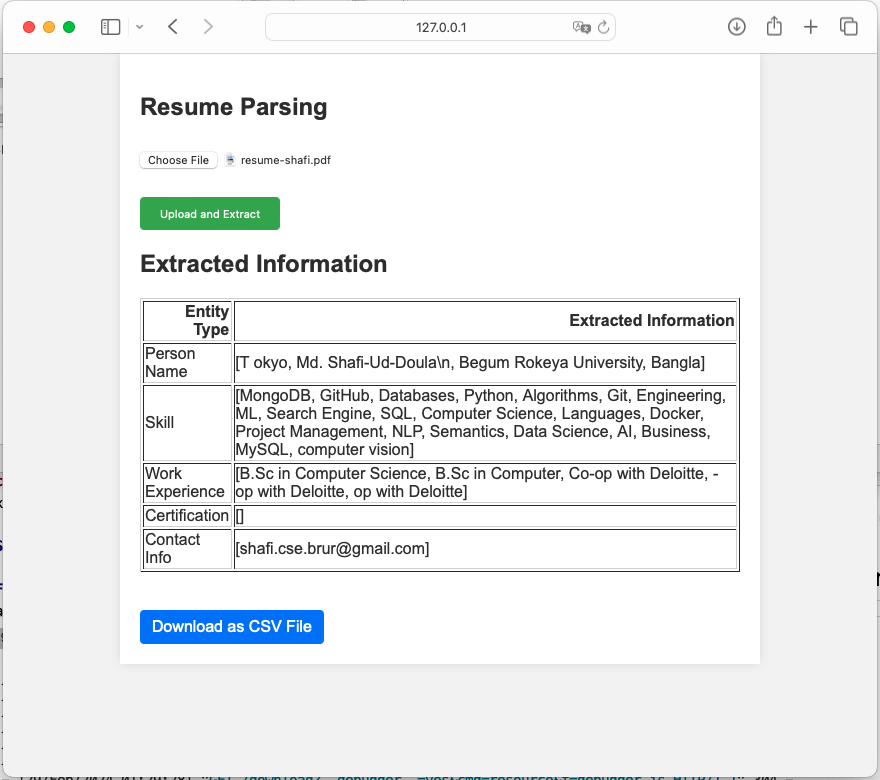
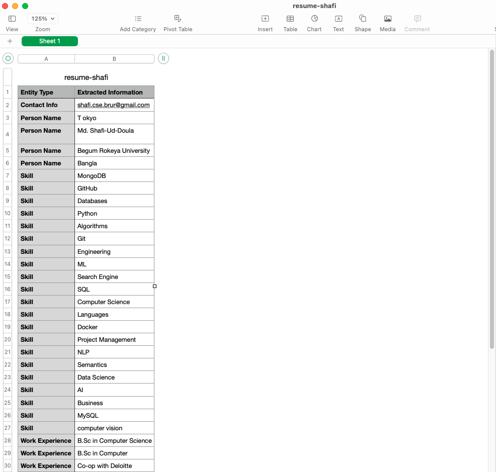

# Resume Parser Project

## Table of Contents
1. [Overview](#overview)
2. [Features](#features)
3. [Dependencies](#dependencies)
4. [Setup Instructions](#setup-instructions)
5. [Usage](#usage)
6. [Development Notes](#development-notes)
7. [Contributing & Support](#contributing--support)
8. [License](#license)
9. [Acknowledgments](#acknowledgments)

## Overview
This project develops a web application that allows users to upload their resume in PDF format. The system then extracts and outputs a list of unique skills, work experiences, certifications, and contact information, showcasing the capabilities of natural language processing using spaCy.

## Features

- **PDF Resume Upload**: Users can upload their resumes in PDF format for parsing.
- **Information Extraction**: Extracts unique skills, work experiences, certifications, and contact information from the uploaded PDF resumes.
- **Structured Output**: Presents the extracted information in a structured table format on the web page.
- **Download Option**: Provides options for users to download the extracted results as a text file.

## Dependencies
- Flask
- spaCy
- pandas
- PyPDF2

Ensure Python 3 installed on system. This project was developed and tested with Python 3.8.

## Setup Instructions

1. **Clone the Repository**

   Clone this repository to local machine to get started with the project.

2. **Virtual Environment (Optional but Recommended)**

   Create a virtual environment to manage project's dependencies separately. create one using:
    
    ```python -m venv venv```

Activate the virtual environment:

- On Windows: `venv\Scripts\activate`
- On macOS/Linux: `source venv/bin/activate`

3. **Install Dependencies**

Install all required dependencies by running:
`pip install -r requirements.txt`


4. **Load spaCy Model**

Before running the application, download the required spaCy language model:

`python -m spacy download en_core_web_md`


5. **Running the Application**

Start the Flask application with:

`python app.py`


Access the web interface at `http://localhost:5000` to upload a PDF resume and see the extracted information.

 Web Application's View
  

  

  

  

 Downloaded extracted file as CSV format (easy to load in excel or any downstream task program)
   

## Usage

- **Uploading a Resume**: Click on "Choose File" to select a PDF resume from local computer, then click "Upload and Extract" to process the file.
- **Viewing Extracted Information**: After processing, the extracted information will be displayed on the webpage. If available, a "Download as Text File" option allows you to download the extracted information.
- **Downloading Extracted Information**: Click on the download link to save the extracted information as a text file.

## Development Notes

- This project extends the resume parser code using spaCy, as per the course's instructions. Customization and enhancements are implemented based on spaCy's capabilities, ensuring the application's efficiency and accuracy in information extraction.
- The web application interface is simple and user-friendly, designed to facilitate easy uploading and extraction of resume information.
- Future improvements may include expanding the parser's capabilities to extract more detailed educational backgrounds and implementing additional output formats like Excel.


## Contributing & Support
Contributions are welcome. For issues or questions, please open an issue in the repository.

## License
This project is licensed under the MIT License.

## Acknowledgments
We extend our gratitude to:

- **Spacy** for proving the libraries to accomplish this task.

- **Flask framework** for enabling the deployment of interactive web applications.

- **Resource Contributions**: Special appreciation to [Chaklam Silpasuwanchai](https://github.com/chaklam-silpasuwanchai) for his invaluable contributions. The codebase for this project drew inspiration and guidance from his [Python for Natural Language Processing](https://github.com/chaklam-silpasuwanchai/Python-for-Natural-Language-Processing) repository, serving as a vital resource.


